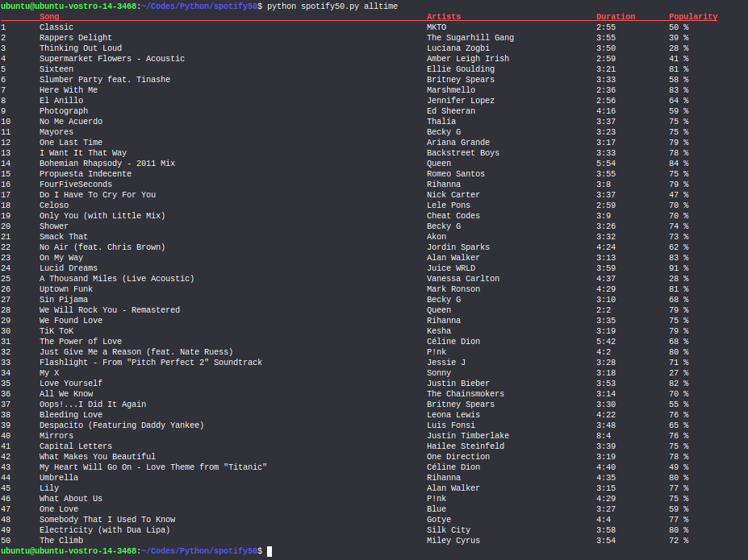

<h1 align="center">spotify50</h1>

Get a User's Top 50 Tracks and their details from Spotify.

## Screenshot

<p align="center">
  
</p>

## Options

```
$ python spotify50.py alltime
```
top 50 calculated from several years of data and including all new data as it becomes available
```
$ python spotify50.py recent
```
top 50 calculated from approximately last 4 weeks of data
```
$ python spotify50.py
```
top 50 calculated form approximately last 6 months of data

## Resources

- https://spotipy.readthedocs.io/en/latest/#
- https://developer.spotify.com/documentation/web-api/
